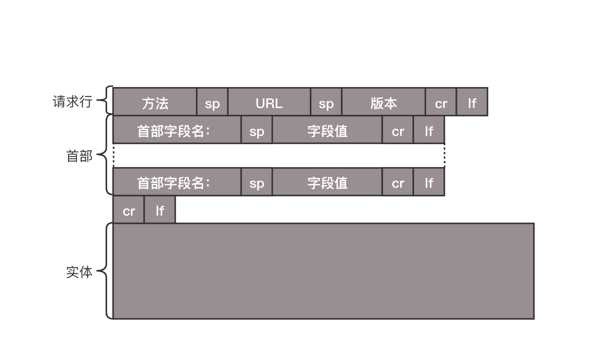
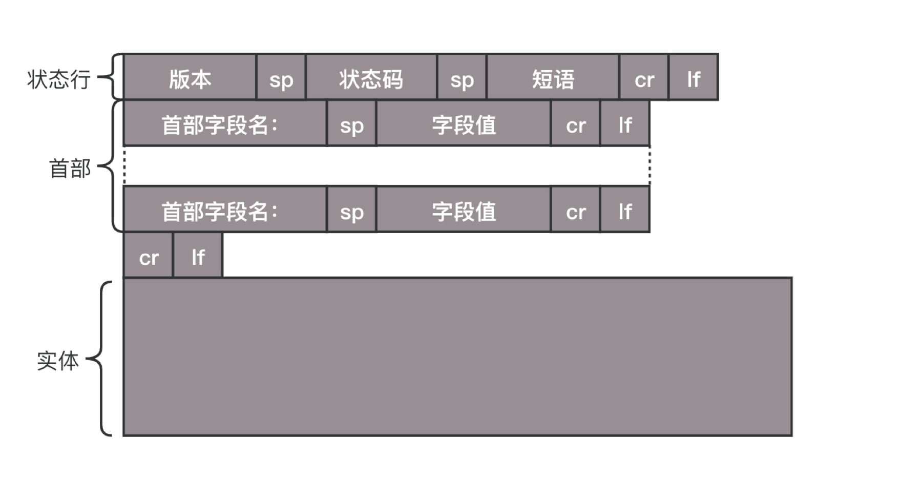

# HTTP

## 报文结构

报文结构分为 3 部分：请求行、首部、实体

### 请求报文结构



#### 请求行

1. 方法，通常分为 get、post、put、delete
   - get 通常用来数据获取，参数在 url 后面拼接，有大小限制
   - post 一般用来创建数据
   - put 通常对数据修改使用
   - delete 一般用来数据删除
   - head -类似于 get，只不过返回的响应中没有具体内容，用于获取报头
2. url，例如 https:// baidu.com
3. 版本，目前流行 1.1 版本

GET 和 POST 有什么区别

- 从缓存的角度，GET 请求会被浏览器主动缓存下来，留下历史记录，而 POST 默认不会。
- 从编码的角度，GET 只能进行 URL 编码，只能接收 ASCII 字符，而 POST 没有限制。
- 从参数的角度，GET 一般放在 URL 中，因此不安全，POST 放在请求体中，更适合传输敏感信息。
- 从回退处理的角度，POST 会重新发起请求，GET 不会

#### 首部字段

- Content-Type 指定报文主体格式，通常使用 application/json
- Cache-control 控制缓存，值如果存在 max-age 字段，当资源缓存时间小于 max-age 时
  就可以使用本地资源，不需要请求服务
- If-Modified-Since 如果服务器的资源在某个时间之后更新了，那么客户端就应该下载最新的资源；如果没有更新，服务端会返回 304 Not Modified 的响应，那客户端就不用下载了

### 响应报文结构



#### 状态行

1. 版本，通常 1.1 版本
2. 状态码
   - 200 请求成功
   - 304 命中缓存
   - 400 客户端报错
   - 500 服务端报错
3. 短语

#### 首部

### cookie

http 是无状态的协议，每个请求都是独立、无关的。cookie 可以让 http 保留状态
cookie 属性：

- 周期，max-age （时间间隔从收到报文开始计算）、expires（过期时间）
- 作用域，domain、path 给 Cookie 绑定了域名和路径，在发送请求之前，发现域名或者路径和这两个属性不匹配
- 安全相关，HttpOnly，如果 cookie 字段带上 HttpOnly，那么说明只能通过 HTTP 协议传输，不能通过 JS 访问

## 缓存

http 会通过几个字段配合浏览器来实现本地缓存，分为强缓存和协商缓存。
强缓存:

- Expires
- Cache-Control

协商缓存

- Last-Modified、If-Modified-Since
- Etag、If-None-Match

## 跨域

当协议、域名、端口不一样时就会产生跨域。
解决跨域的方式：

- jsonp（仅用于 get）
- 反向代理（nginx）
- cors（后端配置 cors）

```js
server {
  listen 80;
  server_name  client.com;
  location /api {
    proxy_pass server.com;
  }
}
```

## 持久链接

Http 初始协议版本中，没进行一次 Http 通信就要断开一次链接（最初需要通信的内容很小），当请求足够大会造成过多通信开销
`请求1 -> 响应1 -> 请求2 -> 响应2 -> 请求3 -> 响应3`

Http/1.1 中默认开启了持久链接 Connection:keep-alive，只要任意一端没有明确提出断开连接，则保持 TCP 连接状态，管线化的特点
`请求1 -> 请求2 -> 请求3 -> 响应1 -> 响应2 -> 响应3`

缺陷：队头阻塞问题

## HTTP2

- 头部压缩
  - 针对头部字段进行压缩，在服务端和客户端中存储一张哈希表，将用过的字段存放在表中，传输使用索引值表示。
- 多路复用
  - 报文的头部和主体拆分成了两个 steam 流，每个 steam 流都会有独立的标识。多个报文可以同时传输，在服务端根据标识重组
- 服务端推送
  - 服务端也可以新建 steam 向客户端发送，无需等待客户端发起请求

## Http/1.1 的长连接和 2.0 的多路复用区别？

- 1.1 同一时间一个 TCP 连接只能处理一个请求，采用一问一答的形式，上一个请求响应后才能处理下一个请求
- 2.0 同域名上所有的通信都在单个连接上完成，单个连接上可以并行交错的进行请求和响应

## 为什么 1.1 不能实现多路复用？

- 2.0 是基于二进制帧的协议，1.1 是基于文本分割解析的协议
- 1.1 的报文结构里，服务器需要不断的读入字节，知道遇到换行符，出的顺序是串行的
- 2.0 以帧为最小数据单位，每个帧都会标识自己属于哪个流，多个帧组成一个流，多路复用，其实就是一个 TCP 里存在多条流
