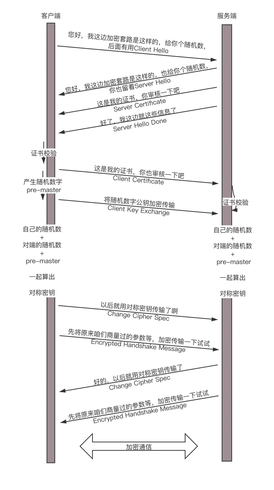

# Https

http 传输过程中容易被中间人攻击，捕获、伪造报文。因此需要在传输过程中对报文进行加密，一般采用两种加密方式（对称加密和非对称加密）。对称加密比非对称加密效率高、性能更好，Https 是在 Http 上建立 SSL 加密层，并对传输数据进行加密，是 Http 协议的安全版

## 对称加密和非对称加密

1. 对称加密：加密和解密使用同一个密钥，任何人只要有密钥就可以解密。转发密钥时存在通信被监听、密钥落入攻击者之手的风险
2. 非对称加密：一把私有密钥，一把公开密钥。发送密文的一方使用对方的公开密钥进行加密处理，对方收到被加密的信息后，再使用自己的私有密钥进行解密。

## CA 证书

当客户端或服务端拿到对方的公钥后，无法确实公钥是否可靠，也有可能是中间人的公钥。这时需要有权威的 CA 机构给公钥做背书，
颁布 CA 证书。

- 生成证书的过程：

1. 服务端在本地生成私钥（openssl genrsa -out cliu8siteprivate.key 1024）
2. 通过私钥生成公钥（openssl rsa -in cliu8siteprivate.key -pubout -outcliu8sitepublic.pem）
3. 通过证书请求生成证书（openssl req -key cliu8siteprivate.key -new -out cliu8sitecertificate.req）
4. 权威机构会通过签名算法对信息做一个 Hash 计算，得到一个 Hash 值。再用权威机构自身的私钥对 Hash 签名。

- 证书内容：
  Issuer，也即证书是谁颁发的；Subject，就是证书颁发给谁；Validity 是证书期限；Public-key 是公钥内容；Signature Algorithm 是签名算法。

- 证书验证过程
  当客户端拿到服务端的证书时，会在系统中的证书链找到颁发服务端证书机构，通过他的公钥解开证书的的签名，如果解开的签名 Hash 和证书中的 Hash 值一样，则证明证书有效。
  当然还存在一个问题，怎么验证客户端的 CA 机构的公钥匙对的呢？所以 CA 的机构的公钥需要有更加权威机构私钥给下一级公钥做背书，层层授信背书形成 CA 链。直到全球几个著名的 CA，称作 root CA

## Https 握手过程

由于对称加密性能更好，所以握手过程采用对称加密。为了公钥不被泄露，会先用非对称加密的方式交换双方公钥。等双方证书验证通过后，生成对称密钥，之后通信采用对称加密通信。

1. 客户端向服务器发送 Client Hello，并带上加密套件、TLS 版本、随机数
2. 服务端发送 Server Hello，确认使用的加密套件和随机数
3. 服务端发送 Server Certificate 将公钥和证书返回给客户端
4. 服务端发送 Server Hello Done 确认就这些信息了
5. 客户端发送 Client Certificate 将客户端的证书给服务端验证
6. 客户端通过 CA 机构验证证书，失败则警告，成功则会生成 Pre-master，同时会发送 Client Key Exchange 把加密过的 Pre-master 传给服务端，双方通过 3 个随机数生成对称密钥
7. 有了对称密钥，客户端就可以发送编码改变通知 Change Cipher Spec，表示以后都采用协商的通信密钥和加密算法进行加密通信了

<!-- 8. 客户端使用伪随机数生成器生成加密使用的对称秘钥，然后用服务端提供的公钥加密，最后将这个会话秘钥发送给服务端
8. 服务端用自己的私钥解密得到对称秘钥，至此客户端和服务端都有了相同的对称秘钥
9. 服务端使用对称秘钥加密明文内容发送给客户端
10. 客户端使用对称秘钥得到明文内容
11. 客户端再次发起 Https 请求 使用对称秘钥加密明文内容，服务端使用对称秘钥解密得到明文内容 -->

## Https 解决 Http 存在的问题

1. 通信使用明文，内容可能被窃听。 ——加密
2. 无法保证报文的完整性，可能遭篡改。 ——数字签名
3. 不验证通信双反的身份，可能遭伪装。 ——数字证书

## TLS/SSL 功能实现

主要依赖 非对称加密、对称加密、散列函数三种算法实现

- 利用非对称加密实现身份认证和秘钥协商
- 利用对称加密将协商好的秘钥对数据进行加密
- 利用散列函数验证信息的完整性

## Https 和 Http 的区别

1. Https 更安全，对搜索引擎更友好，利于 SEO
2. Https 需要 SSL 证书 http 不需要
3. https 标准端口 443 http 80
4. https 基于传输层 http 基于应用层
5. https 在浏览器显示绿色安全锁， http 没有
