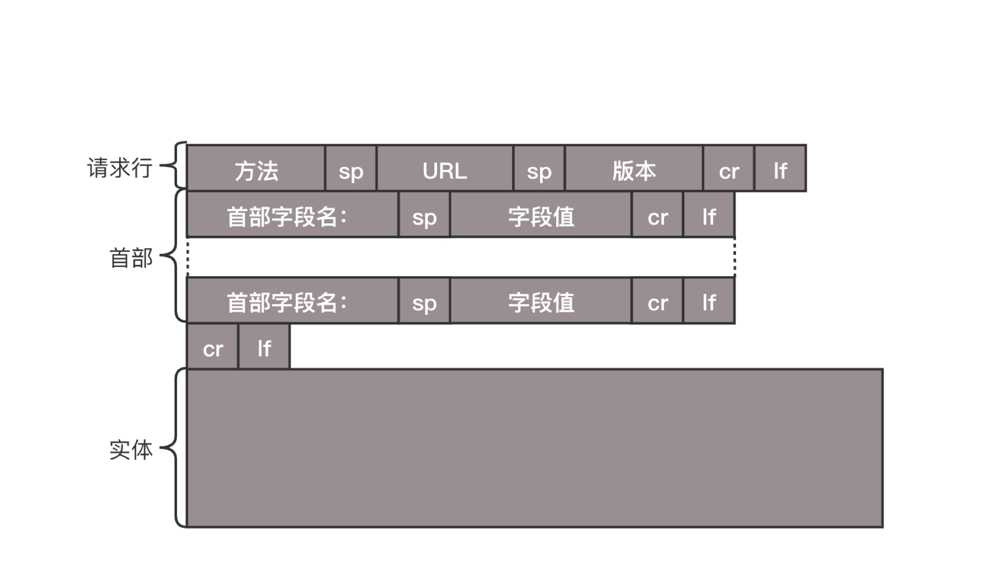
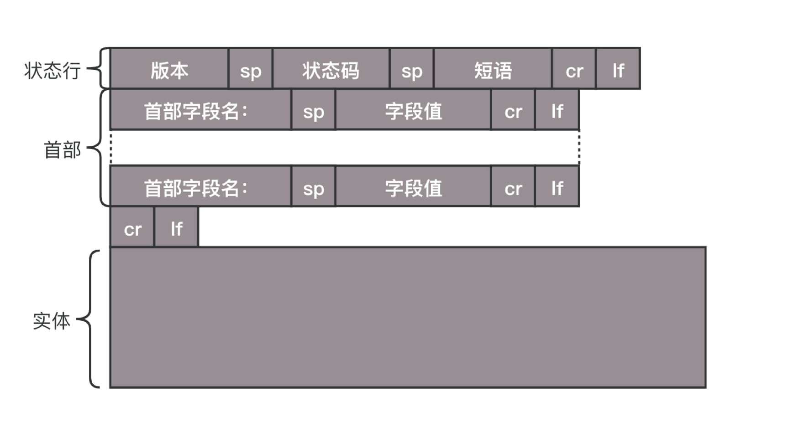

# HTTP

## 报文结构

报文结构分为 3 部分：请求行、首部、实体

### 请求报文结构



#### 请求行

1. 方法，通常分为 get、post、put、delete
   - get 通常用来数据获取，参数在 url 后面拼接，有大小限制
   - post 一般用来创建数据
   - put 通常对数据修改使用
   - delete 一般用来数据删除
2. url，例如 https:// baidu.com
3. 版本，目前流行 1.1 版本

GET 和 POST 有什么区别？

- 从缓存的角度，GET 请求会被浏览器主动缓存下来，留下历史记录，而 POST 默认不会。
- 从编码的角度，GET 只能进行 URL 编码，只能接收 ASCII 字符，而 POST 没有限制。
- 从参数的角度，GET 一般放在 URL 中，因此不安全，POST 放在请求体中，更适合传输敏感信息。

#### 首部字段

- Content-Type 指定报文主体格式，通常使用 application/json
- Cache-control 控制缓存，值如果存在 max-age 字段，当资源缓存时间小于 max-age 时
  就可以使用本地资源，不需要请求服务
- If-Modified-Since 如果服务器的资源在某个时间之后更新了，那么客户端就应该下载最新的资源；如果没有更新，服务端会返回“304 Not Modified”的响应，那客户端就不用下载了

### 响应报文结构



#### 状态行

1. 版本，通常 1.1 版本
2. 状态码
   - 200 请求成功
   - 304 命中缓存
   - 400 客户端报错
   - 500 服务端报错
3. 短语

#### 首部

### cookie

http 是无状态的协议，每个请求都是独立、无关的。cookie 可以让 http 保留状态
cookie 属性：

- 周期，max-age （时间间隔从收到报文开始计算）、expires（过期时间）
- 作用域，domain、path 给 Cookie 绑定了域名和路径，在发送请求之前，发现域名或者路径和这两个属性不匹配
- 安全相关，HttpOnly，如果 cookie 字段带上 HttpOnly，那么说明只能通过 HTTP 协议传输，不能通过 JS 访问

### 缓存

### 跨域

当协议、域名、端口不一样时就会产生跨域。
解决跨域的方式：

- jsonp（仅用于 get）
- 反向代理（nginx）
- cors（后端配置 cors）

```js
server {
  listen 80;
  server_name  client.com;
  location /api {
    proxy_pass server.com;
  }
}
```

# HTTP2

- 头部压缩
  针对头部字段进行压缩，在服务端和客户端中存储一张哈希表，将用过的字段存放在表中，传输使用索引值表示。
- 多路复用

<!-- 三元
https://mp.weixin.qq.com/s?__biz=MzU0MTU4OTU2MA==&mid=2247484035&idx=1&sn=f52a65396e66080bb77c311c67cc92c2&chksm=fb26ebd4cc5162c2da74bbf8ad8e3ddb94a5cc7755f93de8ba543bc0e61a857737c0bd24bcaf&scene=21#wechat_redirect -->
